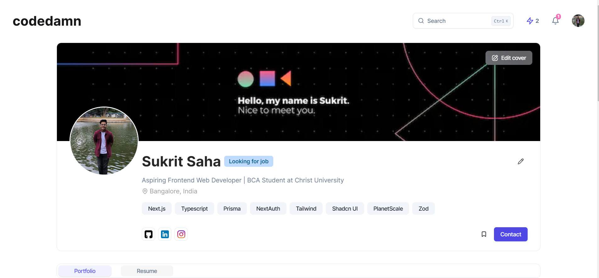

# [Codedamn Frontend Assignment](https://codedamn-frontend-assignment-rho.vercel.app)
Showcase images, projects, certificates, experiences, and education seamlessly for a standout professional portfolio.

[](https://otakusphere.in)

## Tech Stack

- **Framework:** [Next.js](https://nextjs.org)
- **Database:** [MongoDB](https://www.mongodb.com/)
- **Styling:** [Tailwind CSS](https://tailwindcss.com)
- **Authentication:** [NextAuth.js](https://next-auth.js.org/)
- **ORM:** [Prisma ORM](https://www.prisma.io/)
- **UI Components:** [shadcn/ui](https://ui.shadcn.com)
- **File Uploads:** [uploadthing](https://uploadthing.com)
- **Deployment:** [Vercel](https://vercel.com/dashboard)

## Key Features

- Authentication with **NextAuth.js**
- File uploads with **uploadthing**
- ORM using **Prisma ORM**
- Database on **PlanetScale**
- Validation with **Zod**
- Storing data with **MongoDB**
- Responsive design with **Tailwind CSS**

## Key Functionalities

- Updating and display of **personal information** as per the design
- Creation and deletion of **projects**, **certificates**, **experience**, **education**

## Running Locally

1. Clone the repository

```bash
git clone https://github.com/Sukrittt/Otaku-Sphere.git
```

2. Install dependencies using pnpm

```bash
npm install
```

3. Copy the `.env.example` to `.env` and update the variables.

```bash
cp .env.example .env
```

4. Start the development server

```bash
npm run dev
```

5. Push the database schema

```bash
npx prisma db push
```

## How do I deploy this?

Follow the deployment guides for [Vercel](https://create.t3.gg/en/deployment/vercel), [Netlify](https://create.t3.gg/en/deployment/netlify) and [Docker](https://create.t3.gg/en/deployment/docker) for more information.
